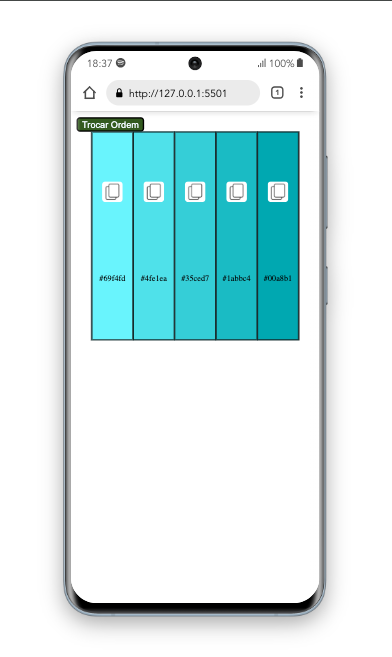

<h1 align="center">
    
</h1>


<h4 align="center">
  PALETA DE CORES.
</h4>

<p align="center">
  <a href="#test_tube-technologies">TeCNOLOGIAS</a>&nbsp;&nbsp;&nbsp;|&nbsp;&nbsp;&nbsp;
  <!-- <a href="#rocket-Getting-started">Getting started</a>&nbsp;&nbsp;&nbsp;|&nbsp;&nbsp;&nbsp; -->
  <a href="#desktop_computer-Project">PROJETO</a>&nbsp;&nbsp;&nbsp;|&nbsp;&nbsp;&nbsp;
  <!-- <a href="#bookmark-Layout">Layout</a>&nbsp;&nbsp;&nbsp;|&nbsp;&nbsp;&nbsp; -->
  <a href="#clapper-Demonstration">DEMONSTRAÇÃO</a>&nbsp;&nbsp;&nbsp;|&nbsp;&nbsp;&nbsp;
  <a href="#sunny-result">RESPONSIVO</a>
</p>

## TECH`S:

O projeto foi desenvolvido com essas tecnologias:


- [html](https://developer.mozilla.org/pt-BR/docs/Web/HTML)
- [css](https://developer.mozilla.org/pt-BR/docs/Web/CSS)
- [javaScript](https://developer.mozilla.org/pt-BR/docs/Web/JavaScript)


## - codigo do projeto

```bash
$ https://github.com/joao20233/consumindo-API-paleta-de-cores- 
````

## - Descrição do projeto

<h4>O projeto foi inspirado no site da collors: Ao qual é uma ferramenta utilizada para colher os hexadecimais das paletas escolhidas e poder ver as cores que fornecem uma melhor combinação. </h4>

.

## - Demonstração

  <div style="display: flex;   flex-direction: column; align-items: center; margin: 15px 0px">
        
  </div>

---


## - Responsivo

  <div style="display: flex;   flex-direction: column;
  align-items: center;">
  <h1 align="center" style="display: flex; flex-direction:row;">
      
  </h1>     
  </div>

  

<p align="center">feito com ❤ por João.</p>
